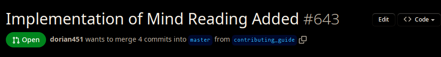
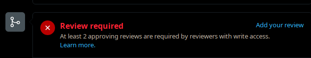

# How to Review a Pull Request

1. Find  a pull request.
2. Find the name of the branch in the pull request:
   * 
   * In this case, the branch name would be `contributing_guide`.
3. Open a terminal and navigate to your local repository (the `yacs.n` folder)
4. Make sure your computer's repo is up to date by running `git pull`.
5. Run `git switch <branch name>`.
6. On some computers, if you are running the local version of YACS already, it will update automatically. If it doesn't, restart Docker and refresh the localhost page.
7. Look at the pull request and verify that whatever functionality it adds works and doesn't seem to cause any problems. 
8. Add your review (whether it's an approval or not) hitting the "add your review" button:
   * 