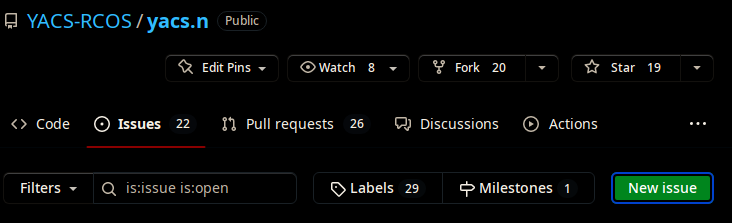
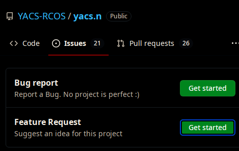
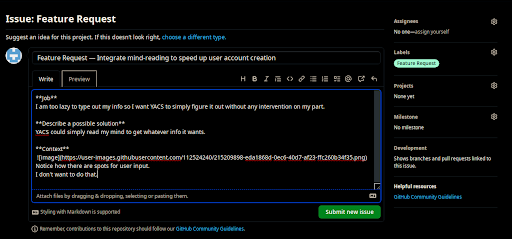

# Opening an Issue:

1. Go to issues and hit "New Issue":

* 

2. Hit "Feature Request":

* 

3. Fill out the template (make sure to add the appropriate labels/projects!):

* 

4. Hit submit issue when done.