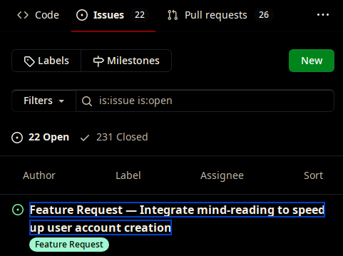
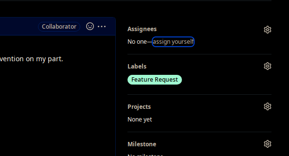
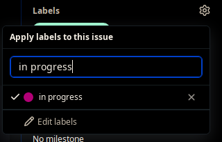
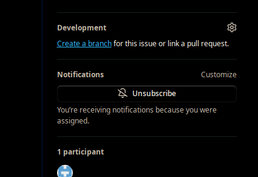
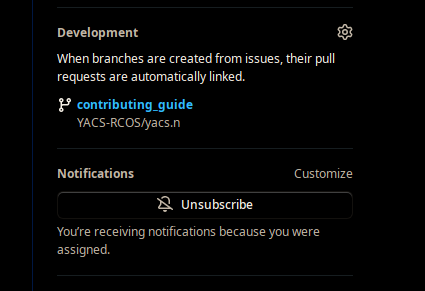
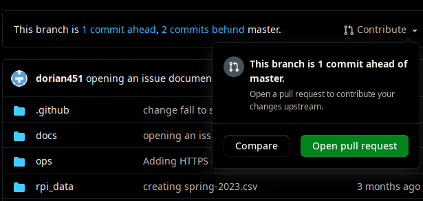
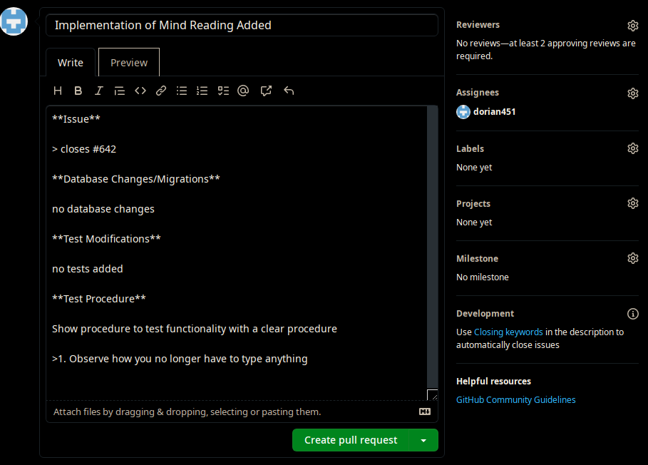

# Working on an Issue:

1. Find an issue you want to work on and open it:

* 

2. Assign yourself to the issue:

* 

3. Add the "in progress" label:

* 

4. Create / assign a branch to the issue:

* 

5. When done, make a pull request:

* click the branch name in the issue:
	* 
* Hit "Contribute", then hit "Open pull request":
	* 
* Fill out the template and, when ready, hit "Create pull Request": (make sure to assign yourself in the Assignees section!)
	* 