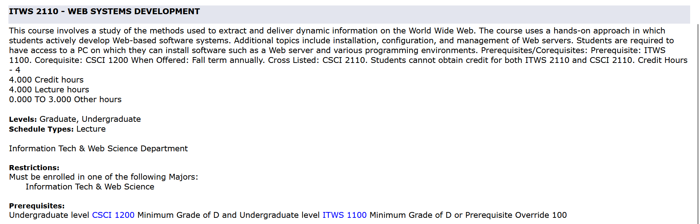
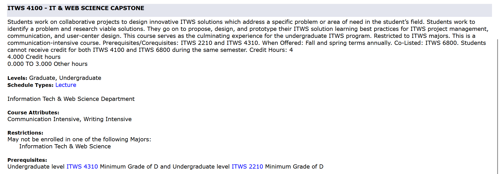
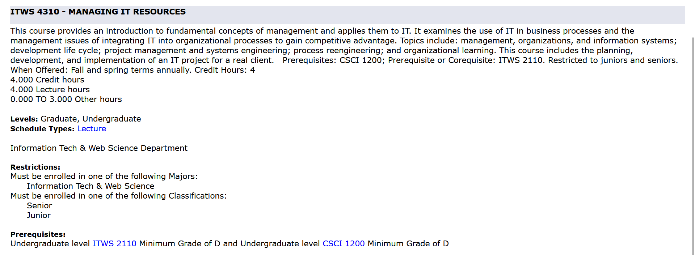
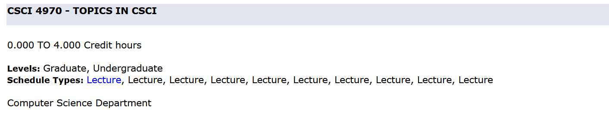

# Package requirements
pandas
bs4
requests
lxml
regex
pyyaml
selenium

# Course Parser
Hopefully this will be the last one.
The relevant files in the folder are csv_to_course.py, course.py, headless_login.py, new_parse.py, and parse_runner.py
The other files in the folder are legacy code that were used in the old web scraper. For now they will remain in here as there are some pieces of code that could be useful if future edge cases pop up.

# How to run
run parse_runner.py with a term as the command argument. The term is formatted as termYEAR. If the specified csv doesn't exist it'll do a full parse, if it does it'll immediately start updating.

# Common issues with SIS scraping

------------------------------------------------------------------------------------------------------------------------------------------
Sel | CRN | Maj | Cod | Sec | Cmp | Crd | Nme | Dys | Tme | Cap | Act | Rem | WLC | WLA | WLR | XLC | XLA | XLR | Prof | Date | Loc | Attr
------------------------------------------------------------------------------------------------------------------------------------------
SR  |99341|CSCI |1100 |01   | T   | 4.00| CSI | MR  |12-150| 24 | 3   | 21  | 0   | 0   | 0   | 0   | 0   | 0   |Stur  |01-04 |TBA  |Intro
------------------------------------------------------------------------------------------------------------------------------------------
While some details have been truncated to fit, this is an example of what we expect a course to be from sis. And for the most part, many courses on sis follow this format.
But, SIS is not perfect, and there are often many mistakes in courses.
The first main one (though this is moreso a design decision than a mistake) is that many parts of courses may be empty, for example
------------------------------------------------------------------------------------------------------------------------------------------
    |     |     |     |     |     |     |     | T  |10-1150|   |     |    |     |     |     |     |     |     |TBA  |01-04 |TBA  |Intro
------------------------------------------------------------------------------------------------------------------------------------------
This is the lab block for the above cs1 course. As you may notice, most of the details are missing, and so it is impossible to build out a course just from this information. 
However, since this appears directly below the cs1 lecture block in sis, we will parse this course immedieatly after parsing the lecture block.
So, we keep a copy of the previous course that we parsed, and use that to fill in information about lab and test blocks.

Another common issue is the use of colspan, for example, Biomed 6940 in spring 2024, which looks like this in SIS
------------------------------------------------------------------------------------------------------------------------------------------
SR  |90453|BMED |6940 |01   | T   | 1-9 | REB | TBA  |     | 0 | 0   | 0  | 0   | 0   | 0   | 0   | 0   | 0   |TBA  |01-04 |TBA  |
------------------------------------------------------------------------------------------------------------------------------------------
However, is parsed as 
------------------------------------------------------------------------------------------------------------------------------------------
SR  |90453|BMED |6940 |01   | T   | 1-9 | REB | TBA       | 0 | 0   | 0  | 0   | 0   | 0   | 0   | 0   | 0   |TBA  |01-04 |TBA  |
-----------------------------------------------------------------------------------------------------------------------------------------
because of the use of colspan in the days column. This means that our indecies are off when we start formatting and processing stuff, which crashes the web scraper. We get around this by inserting a TBA for the value of the colspan that we see.

We also split some fields into two different fields, namely the start and end times a class (eg. 2:00pm - 3:50pm) and the start and end dates of the classes (eg. 01/08-04/24).
However there are often times where courses may have these fields as TBA or blank, eg admin 1030 which looks like this

------------------------------------------------------------------------------------------------------------------------------------------
SR  |93972|ADMN |1030 |01   | T   | 0.00 | AXPA |   |  TBA |1000| 443| 557| 0  | 0   | 0   | 0   | 0  | 0   |Cary  |01-04 |TBA  |
------------------------------------------------------------------------------------------------------------------------------------------

As you can see, the time field is TBA, which we can't easily divide into two seperate fields. At the moment we just add in two TBA's in this case. However in the event that another web scraper is needed or it breaks, this may be a source of failure.

These are the some of the more common offenders, but other issues can pop up, so generally, a row should always have exactly 21 things in it before we begin processing. Many issues that pop up with the webscraper are related to the rows not having a length of 21.

# Common Issues with catalog scraping

Unfortunately, SIS scraping is relatively simple compared to catalog scraping, which has many issues.
Though most of these issues will probably (hopefully) dissapear when the catalog api is implemented.
However I am under the assumption that speedup is all we can except from the api.
So, SIS will not give us everything that we want, in particular the prerequsites and corequisites of a course, in order to get that we will need to scrap from the catalog, in particular, this link
https://sis.rpi.edu/rss/bwckctlg.p_disp_course_detail?cat_term_in=?&subj_code_in=?&crse_numb_in=?
Where you would replace the ?'s with a basevalue (the integer representation of a semester - Spring 2024 -> 202401), Major, and course code.

Because there is notablly less information to parse, there are less issues with the catalog at present, though some of the issues are more severe.

This is as close to the ideal course that one can find, there is a clear list of prerequisites and corequisites, as well as a description. (Though there is a slight issues where it's listed as "Prerequisites/Corequisites: Prerequisite:" instead of "Prerequisites/Corequisites: Prerequisites:" like other courses, but it's pretty good beyond that).

However, there are many courses that do not follow this, for example, 

Even though capstone is listed as having prerequsites or corequisites, it only has prerequisites, and that is difficult for a computer to distinguish, namely because it is missing the "Prerequites:" or "Corequisites" that other courses will have. For reasons that will be mentioned below, this is not too big of an issue with prerequisites, as there is a consistent way to get those, but getting corequisites consistently is difficult.

This is another case of weird prerequisite and corequisite formatting, where is it difficult to parse the two. 

This is RCOS for next semester, however if you did not already know the course code, it would be very impossible to tell that this was RCOS. So, when parsed, there will be no prerequisites, corequisites, or description for the course, even though this is not actually true.

It is worth mentioning that there are two prerequisites, one called prerequisites, ie "Prerequisites/Corequisites: Prerequisites: CSCI 1200 and Introduction to Calculus (MATH 1010 or MATH 1500 or MATH 1020 or MATH 2010); MATH 1020 is strongly recommended.", and another called raw, or raw prerequistes in the database. Raw is

In the webpage. When you click on a course in the explore page, this is the information that is displayed as the prerequisites of a course. Notable, raw is actually reliable and so many of the issues with prerequistes and corequisites mentioned here are mostly dealing with corequisites.

However, aside from raw, all of the other situtations are unique problems that do not have, or have limited solutions in the webscraper, this is especially true with the corequisite problem.